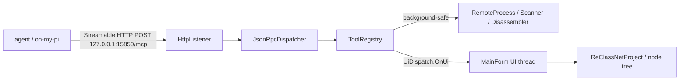

# ReClass.NET MCP plugin design

## 1. Shape

One managed DLL in `<ReClass.NET.exe dir>\Plugins\`, plus one JSON dependency.
Everything runs inside the host process. There is no external process to start
and no Python anywhere in the path.



Assembly identity is forced by the loader:

- file `ReClassNetMcp.dll`, `[assembly: AssemblyProduct("ReClass.NET Plugin")]`
- entry type `ReClassNetMcp.ReClassNetMcpExt : ReClassNET.Plugins.Plugin`
- `AnyCPU`, `net472`; deployed to both `bin\<Cfg>\x86\Plugins\` and `bin\<Cfg>\x64\Plugins\`

## 2. Transport

`HttpListener` prefix `http://127.0.0.1:<port>/mcp/`.

| Case | Response |
| --- | --- |
| POST, body is a request | `200 application/json`, one JSON-RPC response object |
| POST, body is a notification or response | `202 Accepted`, empty body |
| POST, unparseable JSON | `200` with JSON-RPC `-32700`, `id: null` |
| GET | `405 Method Not Allowed` |
| DELETE | `405 Method Not Allowed` |
| `Origin` present and not loopback | `403 Forbidden` |
| `Host` not `127.0.0.1`/`localhost` | `403 Forbidden` |
| `Authorization` missing/wrong | `401` with `WWW-Authenticate: Bearer` |
| `MCP-Protocol-Version` present and unsupported | `400 Bad Request` |

Declared capabilities: `{"tools":{},"resources":{}}`. No `listChanged`, no
`subscribe`, no `logging`, no progress. All of that is capability-gated by the
spec, so SSE, long-lived streams and server-initiated messages are absent from
the implementation entirely.

oh-my-pi's HTTP transport opens an optional background `GET` SSE listener after
`initialize` and silently disables it on `405`, so the 405 answer is the correct
and complete behaviour for this client.

### Protocol versions

Supported set: `2025-11-25` (advertised), `2025-06-18`, `2025-03-26`, `2024-11-05`.
`initialize` echoes the client's version when it is in the set, otherwise answers
`2025-11-25` and lets the client decide. That is the mandated legacy-era path: a
version mismatch is a successful result, not an error.

`2026-07-28` is additive and deferred: a `_meta["io.modelcontextprotocol/protocolVersion"]`
on an incoming request selects the stateless path, which needs `server/discover`,
`resultType` on every result, `ttlMs`/`cacheScope` on list results, and
`Mcp-Method`/`Mcp-Name` header cross-validation. The dispatcher is structured so
this is a second `IProtocolEra` implementation over the same tool registry.

### Auth and binding

- 32 bytes from `RNGCryptoServiceProvider`, base64url, generated on first run
- stored in `%LOCALAPPDATA%\ReClass.NET\mcp\server.json` together with the port
- compared by `SHA256` of both operands then a constant-time byte compare, so
  neither value nor length leaks
- loopback-only prefix; `Origin` and `Host` both validated (Origin alone does not
  stop a browser page that rebound a name to 127.0.0.1)

### Port and discovery

Canonical port `15850`. On conflict, scan `15850..15949`. The chosen port, pid,
bitness, attached process and token fingerprint are written atomically
(temp + `File.Replace`) to
`%LOCALAPPDATA%\ReClass.NET\mcp\instance_<pid>.json`. Stale files are pruned by
pid liveness. This is what lets the installer emit a correct URL without asking,
and lets a second (x86) instance coexist with the first.

## 3. Threading

`UiDispatch` is the only bridge to the UI thread:

```
T OnUi<T>(Func<T> fn, int timeoutMs)
void OnUi(Action fn, int timeoutMs)
```

- uses `Program.MainForm.Invoke`, guarded on `IsHandleCreated` and `!IsDisposed`
- unwraps `TargetInvocationException` with `ExceptionDispatchInfo.Capture(inner).Throw()`
  so a `ToolException` survives the hop as itself
- never called from inside another `OnUi` (reentrancy asserted in debug)

Rules derived from the host source:

- every project and node access is marshalled, reads included. The node tree has
  no locking and the render loop walks it concurrently
- memory reads/writes, scanning, disassembly, dumping, pattern search and
  `NodeDissector.GuessNode` run on the request thread, never on the UI thread
- the UI hop only ever carries a *projection* (small POCO snapshots); JSON
  serialization happens off-thread
- a mutating tool takes one hop wrapping `BeginUpdate`/`EndUpdate` for the whole batch
- `notifications/cancelled` cancels the request's `CancellationTokenSource`;
  long reads and scans observe it

## 4. Identity and handles

- class handle: `ClassNode.Uuid` (`"d3b0…"`), the only stable identity in the model
- node handle: `<classUuid>:<i>/<j>/<k>`, child indices from the class root,
  resolved through `BaseContainerNode.Nodes` / `BaseWrapperNode.InnerNode`
- every mutating tool returns the affected handles after the mutation, because
  index paths shift on insert/remove
- enums are identified by name (the host has no enum uuid); renaming an enum breaks
  `EnumNode` references on the next load, so `rename_enum` warns in its result

## 5. Result contract

Every tool returns `structuredContent` plus a compact text mirror. Rules:

- addresses are lowercase hex with `0x` prefix, always as strings
- byte payloads carry both `hex` and `base64`
- lists are paginated (`offset`, `limit`, `total`, `hasMore`) and projectable (`fields`)
- read-shaped tools accept a batch: `read_memory`, `read_typed`, `resolve_address`,
  `add_node`, `delete_node`, `set_node_name` all take arrays

### Output cap

Central, in the dispatcher, not per tool. `structuredContent` over 50 000 chars is
stored under a GUID (in-memory FIFO, 32 entries, 64 MB budget) and replaced by a
preview: lists truncated to 10 items, strings to 1000 chars, depth 5. Truncation is
signalled in `_meta["net.reclass/truncated"]` and a text block naming the retrieval
tool. Sentinel objects are never injected into arrays (they violate
`additionalProperties: false` item schemas). Retrieval: `get_output(id, offset, limit)`.

`net.reclass/` is used for every custom `_meta` key; `io.modelcontextprotocol/`,
`dev.mcp/` and any prefix whose second label is `mcp`/`modelcontextprotocol` are
reserved by the spec.

### Error taxonomy

| Class | Wire form | Meaning |
| --- | --- | --- |
| `InvalidArgumentsException` | JSON-RPC `-32602` | malformed call the model cannot fix by retrying with the same shape |
| `ToolException` | `isError: true` result with a text block | expected domain failure (no process attached, class not found, read failed); model-readable and recoverable |
| anything else | JSON-RPC `-32603` + host log | bug |

Per the 2025-11-25 revision, input *validation* failures should surface as
`isError: true` so the model can self-correct; only protocol-level shape errors use
`-32602`.

## 6. Mutation safety

The host has no undo, no dirty flag and no save prompt. The plugin supplies them:

- before any mutating tool, `ReClassNetFile.Save(MemoryStream, logger)` snapshots the
  whole project into a ring of 16 entries with the tool name and timestamp
- `undo_last_change` restores by `Load`ing the snapshot into a fresh project and
  `MainForm.SetProject`
- `list_changes` shows the ring
- every mutation is logged through `IPluginHost.Logger`; the human is watching that
  window, and it is the cheapest audit trail available
- `write_memory`, `write_typed` and `control_process` are annotated
  `destructiveHint: true, readOnlyHint: false` and are additionally gated by the
  `AllowMutations` setting; a readonly toggle hides them from `tools/list` entirely

## 7. Tool surface

~55 tools. Annotations are set explicitly on every one, because the spec's defaults
are pessimistic (`destructiveHint` and `openWorldHint` default to `true` when omitted).

| Group | Tools |
| --- | --- |
| server | `status`, `get_output` |
| process | `list_processes`, `attach_process`, `detach_process`, `process_info`, `list_modules`, `list_sections`, `resolve_address`, `list_named_addresses`, `control_process` ⚠ |
| memory | `read_memory`, `read_typed`, `read_string`, `write_memory` ⚠, `write_typed` ⚠, `find_pattern`, `disassemble`, `dump_region` |
| scanner | `scan_start`, `scan_next`, `scan_results`, `scan_undo`, `scan_reset`, `scan_status` |
| project | `project_info`, `new_project`, `open_project`, `save_project`, `list_classes`, `get_class`, `create_class`, `rename_class`, `set_class_address`, `set_class_comment`, `delete_class`, `remove_unused_classes`, `undo_last_change`, `list_changes` |
| nodes | `list_node_types`, `add_node`, `insert_node`, `delete_node`, `change_node_type`, `set_node_name`, `set_node_comment`, `set_node_size`, `set_wrapped_type`, `set_class_reference`, `add_bytes`, `insert_bytes`, `suggest_types`, `dissect_nodes` |
| enums | `list_enums`, `create_enum`, `set_enum_values`, `rename_enum`, `delete_enum` |
| codegen | `generate_code` |
| view | `select_class`, `get_selection` |

Resources: `reclass://project`, `reclass://process`, `reclass://modules`,
`reclass://sections`, `reclass://node-types`, and template
`reclass://class/{uuid}`.

Deliberately excluded: software breakpoints (the host never dispatches their
handlers), `FindWhatAccessesAddress`/`FindWhatWritesToAddress` (they `Show()` a
modal-ish form and their breakpoint handler blocks on the UI thread, so a headless
watch tool would be a separate design), the three `Legacy/` node types and
`ClassNode`/`VirtualMethodNode` as creatable types.

### Schemas

Declared once, next to the handler, through a small typed builder
(`Schema.Object(...)`, `Schema.Hex()`, `Schema.BatchOf(...)`), so `inputSchema` and
the argument parser cannot drift. `outputSchema` is emitted for every tool with a
stable result shape and its root is always `type: "object"`.

Names match the spec's guidance: `[A-Za-z0-9_.-]`, 1-128 chars.

## 8. Install

Primary target is oh-my-pi.

`MCP Server` menu in `MainForm.MainMenu`:

- `Enabled` (checkbox), `Status…`, `Copy endpoint`, `Copy token`, `Copy config JSON`
- `Install for ▸ oh-my-pi (user) / oh-my-pi (project…) / Claude Code / Cursor / VS Code / Codex`
- `Allow mutations` (checkbox), `Open log`

The oh-my-pi writer produces, into `~/.omp/agent/mcp.json` (or `<project>/.omp/mcp.json`):

```json
{
  "$schema": "https://raw.githubusercontent.com/can1357/oh-my-pi/main/packages/coding-agent/src/config/mcp-schema.json",
  "mcpServers": {
    "reclass": {
      "type": "http",
      "url": "http://127.0.0.1:15850/mcp",
      "headers": { "Authorization": "Bearer <token>" },
      "timeout": 120000
    }
  }
}
```

- merges into the existing file, touching only its own key, atomic temp + replace
- adds `$schema` when creating the file, matching what oh-my-pi itself writes
- server name is `reclass` for the x64 host and `reclass-x86` for the x86 host, so
  both instances can be registered simultaneously and neither shadows the other
- re-writes the URL on startup when the port changed, only if the entry is one we own
- reports the exact follow-up to the user: `/mcp reload`, then `/mcp test reclass`

The same writer handles Claude Code (`~/.claude.json`), Cursor (`~/.cursor/mcp.json`),
VS Code (`.vscode/mcp.json`, `servers` key not `mcpServers`) and Codex
(`~/.codex/config.toml`, `[mcp_servers.reclass]`).

A skill ships next to the DLL as `skills/reclass/SKILL.md` and is installed to
`~/.omp/agent/skills/reclass/`. Tool descriptions teach verbs; the skill teaches the
loop: attach, resolve a formula, read a window, guess field boundaries, type them,
verify neighbours, name them, generate code.

## 9. Test strategy

The protocol and tool layers are decoupled from WinForms behind `IReClassHost`
(project access, UI dispatch, process access, logging). Real implementation binds to
`Program`/`MainForm`; the test fake is pure managed state.

- xUnit: JSON-RPC framing, notification-never-answered, version negotiation, auth
  compare, origin/host rejection, output cap and preview shape, handle resolution,
  argument validation, error taxonomy mapping, snapshot/undo round-trip
- smoke: run the server against the fake host and drive a real `initialize` →
  `tools/list` → `tools/call` sequence over HTTP
- end-to-end: launch the built ReClass.NET, attach to a live process, register with
  oh-my-pi, and drive class creation, node typing, memory read and code generation
  from an agent session
